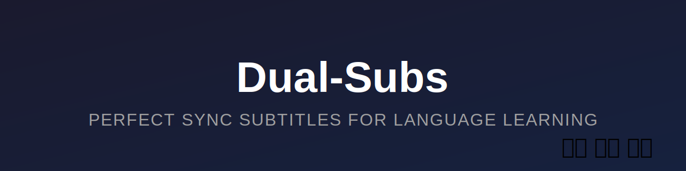
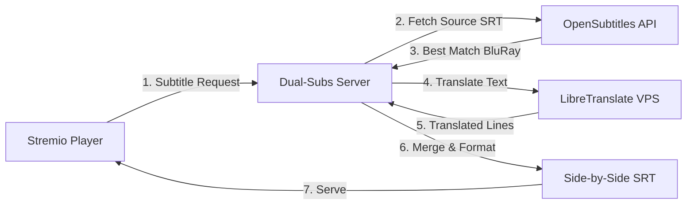

<div align="center">



[](https://opensource.org/licenses/MIT)
[](https://nodejs.org)
[](https://www.stremio.com/)

**Master languages effortlessly with AI-powered, perfectly synchronized dual subtitles.**

</div>


---

## 🎯 Quick Start

### 🚀 Use the Hosted Version (Recommended)

**No setup required** - Just add the addon URL:

1. **Open Stremio** (desktop or web app)
2. **Go to Add-ons** (⊕ icon in the top-right or sidebar)
3. **Paste this URL** in the addon input field:
   ```
   https://dual-subtitles-stremio-addon.onrender.com/manifest.json
   ```
4. **Click "Install"** and you're done! 🎉

> **⏱️ First-time note:** The first subtitle generation for a new movie/episode takes **6-7 minutes** (~55 sec per 100 lines). After that, it's cached and loads **instantly** for everyone.

---

## ✨ Features

### **Perfect Synchronization (AI-Powered)**
- **One Source, Perfect Sync**: Downloads a single high-quality subtitle and translates it line-by-line using AI
- **Zero Timing Gaps**: Unlike dual-file approaches, translation ensures timestamps are **mathematically identical**
- **Smart Caching**: 24-hour cache means subsequent loads are instant

### 🌐 **Supported Language Pairings**
| Base Language | Translated To |
|--------------|---------------|
| 🇪🇸 **Spanish** | English, Français |
| 🇬🇧 **English** | Español, Français |
| 🇫🇷 **French** | English, Español |

### 🎨 **Visual Design**
- **Side-by-Side Layout**: `Original Text  |  Translated Text`
- **Italics Differentiation**: Secondary language is styled in *italics* for easy distinction
- **Optimized Padding**: Fixed-width columns for visual alignment

### ⚙️ **Technical Highlights**
- **Self-Hosted Translation**: LibreTranslate on private VPS (no rate limits, 100% control)
- **API Key Rotation**: Built-in rotation across 10 OpenSubtitles keys for high availability
- **BluRay Priority**: Intelligent subtitle selection favoring BluRay releases for perfect sync
- **Anti-Sleep**: Keeps Render free tier alive with periodic health pings

---

## 🛠️ How It Works

### Architecture Overview



### Translation Pipeline

1. **Download**: Fetch the best BluRay subtitle file for the base language (e.g., Spanish)
2. **Parse**: Extract text and timestamps using SRT parser
3. **Translate**: Send text in parallel batches to self-hosted LibreTranslate (3 concurrent requests)
4. **Reconstruct**: Create a "virtual" translated SRT using the **exact same timestamps**
5. **Merge**: Combine both SRTs side-by-side with visual formatting
6. **Cache**: Store for 24h to speed up future requests

**Performance**: ~6-7 minutes for a typical 700-line episode (~55 sec per 100 lines), instant cache hits thereafter.

---

## 📸 Screenshots

### In-App Experience
The addon appears in Stremio's subtitle menu with clear language indicators:

```
Dual 🇪🇸 🇬🇧  [ES] Español ➜ English (AI)
Dual 🇪🇸 🇫🇷  [ES] Español ➜ Français (AI)
Dual 🇬🇧 🇪🇸  [EN] English ➜ Español (AI)
Dual 🇬🇧 🇫🇷  [EN] English ➜ Français (AI)
Dual 🇫🇷 🇬🇧  [FR] Français ➜ English (AI)
Dual 🇫🇷 🇪🇸  [FR] Français ➜ Español (AI)
```

### Playback Result

---


---

## 💻 Self-Hosting Guide

### Prerequisites

- **Node.js** ≥ 18.0.0
- **OpenSubtitles API Key(s)** ([Get free here](https://www.opensubtitles.com/en/consumers))
- **LibreTranslate VPS** (recommended: Contabo Cloud VPS M, €5/month)

### Part 1: Setup LibreTranslate Server

LibreTranslate provides unlimited, high-quality translations without external API dependencies.

#### Option A: Contabo VPS (Recommended - €5/month)

**Specs**: 6 vCPU, 12GB RAM, 100GB NVMe  
**Performance**: ~55 sec per 100 lines (~6-7 min for typical episode)

1. **Create VPS**:
   - Go to [Contabo Cloud VPS](https://contabo.com/en/vps/cloud-vps-1/)
   - Select **Cloud VPS M** (6 vCPU, 12GB RAM)
   - Region: **Germany (EU)**
   - OS: **Ubuntu 22.04 LTS**

2. **SSH into server**:
   ```bash
   ssh root@YOUR_VPS_IP
   ```

3. **Install Docker**:
   ```bash
   curl -fsSL https://get.docker.com -o get-docker.sh
   sh get-docker.sh
   apt install docker-compose -y
   ```

4. **Setup LibreTranslate**:
   ```bash
   mkdir -p /opt/libretranslate && cd /opt/libretranslate
   nano docker-compose.yml
   ```

   Paste this **optimized** configuration:
   ```yaml
   version: '3.8'
   services:
     libretranslate:
       image: libretranslate/libretranslate:latest
       container_name: libretranslate
       restart: unless-stopped
       ports:
         - "8080:5000"
       environment:
         LT_LOAD_ONLY: "en,es,fr"
         LT_HOST: "0.0.0.0"
         LT_CHAR_LIMIT: "100000"       # High limit for batch processing
         LT_REQ_LIMIT: "0"              # No request limit
         LT_THREADS: "6"                # Match vCPU count
         ARGOS_VERSION_EN_ES: "1.0.0"   # Pin specific model version
         LT_BATCH_LIMIT: "100"          # Allow batch translations
       # No volume mounts - Docker manages model storage internally
       healthcheck:
         test: ["CMD", "curl", "-f", "http://localhost:5000/"]
         interval: 30s
         timeout: 10s
         retries: 3
         start_period: 120s
   ```

5. **Start LibreTranslate**:
   ```bash
   docker-compose up -d
   ```
   
   > **Note**: First startup takes ~2-3 minutes to download language models. Check logs with `docker logs -f libretranslate`

6. **Configure Firewall**:
   ```bash
   apt install ufw -y
   ufw allow 22/tcp
   ufw allow 8080/tcp
   ufw enable
   ```

7. **Test**:
   ```bash
   curl -X POST http://localhost:8080/translate \
     -H "Content-Type: application/json" \
     -d '{"q":"Hello","source":"en","target":"es"}'
   ```

   Should return: `{"translatedText":"Hola"}`

---

### Part 2: Setup Stremio Addon

#### Installation

```bash
# Clone the repository
git clone https://github.com/blackcat112/dual-subtitles-stremio-addon.git
cd dual-subtitles-addon

# Install dependencies
npm install

# Configure environment
cp .env.example .env
```

#### Configuration

Edit `.env`:

```bash
# OpenSubtitles API Keys (comma-separated for rotation)
OPENSUBTITLES_API_KEYS=key1,key2,key3,key4,key5,key6,key7,key8,key9,key10

# LibreTranslate URL (your VPS IP)
LIBRETRANSLATE_URL=http://YOUR_VPS_IP:8080

# Optional: Custom port
PORT=7001
```

#### Running Locally

```bash
# Development mode (with hot reload)
npm run dev

# Production build
npm run build
npm start
```

The addon will be available at `http://localhost:7001/manifest.json`

#### Deployment to Render (Free Tier)

1. **Fork this repository**
2. **Connect to [Render](https://render.com)**
3. **Create a new Web Service**
4. **Configure**:
   - **Build Command**: `npm install && npm run build`
   - **Start Command**: `npm start`
   - **Environment Variables**:
     - `OPENSUBTITLES_API_KEYS`: Your comma-separated keys
     - `LIBRETRANSLATE_URL`: `http://YOUR_VPS_IP:8080`
5. **Deploy** and use the provided URL

---

## 🧪 Technical Stack

| Component | Technology |
|-----------|-----------|
| **Runtime** | Node.js 18+ + TypeScript |
| **Framework** | Express.js + Stremio SDK |
| **Subtitle Source** | OpenSubtitles REST API v1 |
| **Translation** | LibreTranslate (self-hosted) |
| **Parsing** | srt-parser-2 |
| **Caching** | In-memory (24h TTL) |
| **Addon Host** | Render.com (Free Tier) |
| **Translation Host** | Contabo VPS (€5/month) |

---

## 📁 Project Structure

```
dual-subtitles-addon/
├── src/
│   ├── addon.ts                    # Stremio addon handler (menu generation)
│   ├── server.ts                   # Express server (subtitle serving)
│   ├── config/
│   │   └── manifest.ts             # Addon metadata
│   ├── services/
│   │   ├── opensubtitles.ts        # API client with key rotation & BluRay priority
│   │   ├── libretranslate-client.ts # LibreTranslate VPS client
│   │   ├── translator.ts           # Translation orchestration
│   │   ├── subtitleFetcher.ts      # Download & translation pipeline
│   │   └── subtitleMerger.ts       # Side-by-side formatting
│   └── utils/
│       ├── cache.ts                # In-memory caching
│       ├── srtParser.ts            # SRT parsing/serialization
│       └── logger.ts               # Colored logging
├── public/
│   ├── logo.png                    # Addon icon
│   ├── banner.svg                  # Banner image
│   ├── captura.png                 # Screenshot
│   └── configure.html              # Configuration page
└── package.json
```

---

## ⚙️ Configuration

### Environment Variables

| Variable | Required | Description | Example |
|----------|----------|-------------|---------|
| `OPENSUBTITLES_API_KEYS` | Yes | Comma-separated OpenSubtitles API keys | `key1,key2,key3` |
| `LIBRETRANSLATE_URL` | Yes | Self-hosted LibreTranslate server URL | `http://95.217.XXX.XXX:5000` |
| `PORT` | No | Server port (default: 7001) | `7001` |
| `CACHE_TTL` | No | Cache duration in seconds (default: 86400) | `86400` |

### BluRay Priority System

The addon uses intelligent subtitle selection with a scoring system:

- **BluRay releases**: +15 points (highest priority)
- **WEB-DL**: +8 points
- **WEBRip**: +7 points  
- **HDTV**: +5 points (lower priority due to recap/desync issues)
- **High download count**: Up to +10 points
- **Hearing impaired**: -5 points

This ensures the best sync quality for your video sources.

---

## 🚀 Performance

### Translation Speed

| Episode Length | Lines | LibreTranslate Time | Cache Hit |
|---------------|-------|---------------------|-----------|
| Short (20 min) | ~400 | ~3.5 minutes | Instant |
| Standard (45 min) | ~700 | ~6-7 minutes | Instant |
| Long (60+ min) | ~1000 | ~9 minutes | Instant |

**Rate**: ~55 seconds per 100 lines (3 concurrent requests, benchmarked)

### Cost Breakdown

| Service | Cost | Purpose |
|---------|------|---------|
| **Render.com** | Free | Hosts Stremio addon server |
| **Contabo VPS** | €5/month | LibreTranslate translation engine |
| **OpenSubtitles** | Free | Subtitle downloads (5/day per key) |
| **Total** | **€5/month** | Complete solution |

---

## ⚠️ Known Limitations

### OpenSubtitles API Quota
- Free tier: **5 downloads/day** per key
- **Mitigation**: Use 10+ API keys (rotation logic included)
- Subtitle quality varies by language/release

### Cache Persistence
- Uses in-memory cache (resets on server restart)
- For production: Consider Redis or file-based cache

### Language Support
- Currently supports: English, Spanish, French
- To add more languages: Update `LT_LOAD_ONLY` in LibreTranslate config and download models

---

## 🤝 Contributing

Contributions are welcome! Here's how:

1. **Fork** the repository
2. **Create** a feature branch (`git checkout -b feature/amazing-feature`)
3. **Commit** your changes (`git commit -m 'Add amazing feature'`)
4. **Push** to the branch (`git push origin feature/amazing-feature`)
5. **Open** a Pull Request

### Development Tips
- Use `npm run dev` for auto-reloading
- Test with `npm run test:api` to verify OpenSubtitles connection
- Check TypeScript errors with `npm run build`

---

## 📜 License

This project is licensed under the **MIT License** - see [LICENSE](LICENSE) file for details.

You are free to:
- ✅ Use commercially
- ✅ Modify
- ✅ Distribute
- ✅ Private use

---

## 👨‍💻 Author

**Nicolas Becas**
- 💼 LinkedIn: [linkedin.com/in/nicolasbecas](https://linkedin.com/in/nicolasbecas)
- 🐙 GitHub: [@blackcat112](https://github.com/blackcat112)

---

## ⭐ Support

If this addon helped you learn a new language or improved your viewing experience:
- ⭐ **Star this repo** on GitHub
- 🐛 **Report bugs** via [Issues](https://github.com/blackcat112/dual-subtitles-stremio-addon/issues)
- 💡 **Suggest features** for future updates

---

## 🙏 Acknowledgments

- [Stremio](https://www.stremio.com/) for the amazing platform
- [OpenSubtitles](https://www.opensubtitles.com/) for subtitle data
- [LibreTranslate](https://libretranslate.com/) for open-source translation
- [Contabo](https://contabo.com/) for affordable VPS hosting

---
