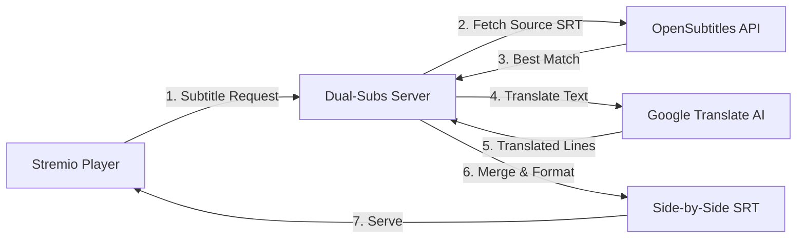

<div align="center">


[](https://opensource.org/licenses/MIT)
[](https://nodejs.org)
[](https://www.stremio.com/)

**Master languages effortlessly with AI-powered, perfectly synchronized dual subtitles.**

</div>


---

## 🎯 Quick Start

### 🚀 Use the Hosted Version (Recommended)

**No setup required** - Just add the addon URL:

1. **Open Stremio** (desktop or web app)
2. **Go to Add-ons** (⊕ icon in the top-right or sidebar)
3. **Paste this URL** in the addon input field:
   ```
   https://dual-subtitles-stremio-addon.onrender.com/manifest.json
   ```
4. **Click "Install"** and you're done! 🎉

> **⏱️ First-time note:** The first subtitle generation for a new movie/episode takes **10-15 minutes** (to avoid rate limits). After that, it's cached and loads **instantly** for everyone.

---

## ✨ Features

### 🤖 **Perfect Synchronization (AI-Powered)**
- **One Source, Perfect Sync**: Downloads a single high-quality subtitle and translates it line-by-line using AI
- **Zero Timing Gaps**: Unlike dual-file approaches, translation ensures timestamps are **mathematically identical**
- **Smart Caching**: 24-hour cache means subsequent loads are instant

### 🌐 **Supported Language Pairings**
| Base Language | Translated To |
|--------------|---------------|
| 🇪🇸 **Spanish** | English, Français |
| 🇬🇧 **English** | Español, Français |

### 🎨 **Visual Design**
- **Side-by-Side Layout**: `Original Text | Translated Text`
- **Italics Differentiation**: Secondary language is styled in *italics* for easy distinction
- **Optimized Padding**: Fixed-width columns for visual alignment

### ⚙️ **Technical Highlights**
- **On-Demand Loading**: Only generates subtitles when you click play (saves API quota)
- **API Key Rotation**: Built-in rotation across 8+ OpenSubtitles keys for high availability
- **Retry Logic**: Exponential backoff for translation rate limits (429 errors)
- **Anti-Sleep**: Keeps Render free tier alive with periodic health pings

---

## 🛠️ How It Works

### Architecture Overview



### Translation Pipeline

1. **Download**: Fetch the best subtitle file for the base language (e.g., Spanish)
2. **Parse**: Extract text and timestamps using SRT parser
3. **Translate**: Send text in batches to Google Translate (3 lines/batch, 400ms delay)
4. **Reconstruct**: Create a "virtual" translated SRT using the **exact same timestamps**
5. **Merge**: Combine both SRTs side-by-side with visual formatting
6. **Cache**: Store for 24h to speed up future requests

---

## 📸 Screenshots

### In-App Experience
The addon appears in Stremio's subtitle menu with clear language indicators:

```
Dual 🇪🇸 🇬🇧  [ES] Español ➜ English (AI)
Dual 🇪🇸 🇫🇷  [ES] Español ➜ Français (AI)
Dual 🇬🇧 🇪🇸  [EN] English ➜ Español (AI)
Dual 🇬🇧 🇫🇷  [EN] English ➜ Français (AI)
```

### Playback Result


---

## � Self-Hosting (For Developers)

### Prerequisites
- Node.js ≥ 18.0.0
- **OpenSubtitles API Key(s)** ([Get one here](https://www.opensubtitles.com/en/consumers))

### Installation

```bash
# Clone the repository
git clone https://github.com/blackcat112/dual-subtitles-stremio-addon.git
cd dual-subtitles-addon

# Install dependencies
npm install

# Configure environment
cp .env.example .env
# Edit .env and add your OpenSubtitles API key(s)
```

### Configuration

Edit `.env`:

```bash
# Single key (basic)
OPENSUBTITLES_API_KEY=your_api_key_here

# Multiple keys for rotation (recommended)
OPENSUBTITLES_API_KEYS=key1,key2,key3,key4,key5,key6,key7,key8

# Optional: Custom port
PORT=7001
```

### Running Locally

```bash
# Development mode (with hot reload)
npm run dev

# Production build
npm run build
npm start
```

The addon will be available at `http://localhost:7001/manifest.json`

### Deployment to Render (Free Tier)

1. Fork this repository
2. Connect to [Render](https://render.com)
3. Create a new **Web Service**
4. Use these settings:
   - **Build Command**: `npm install && npm run build`
   - **Start Command**: `npm start`
   - **Environment Variables**: Add `OPENSUBTITLES_API_KEYS`
5. Deploy and use the provided URL

---

## 🧪 Technical Stack

| Component | Technology |
|-----------|-----------|
| **Runtime** | Node.js + TypeScript |
| **Framework** | Express.js + Stremio SDK |
| **Subtitle Source** | OpenSubtitles REST API |
| **Translation** | google-translate-api-x (unofficial) |
| **Parsing** | srt-parser-2 |
| **Caching** | In-memory (24h TTL) |
| **Deployment** | Render.com (Free Tier) |

---

## � Project Structure

```
dual-subtitles-addon/
├── src/
│   ├── addon.ts              # Stremio addon handler (menu generation)
│   ├── server.ts             # Express server (subtitle serving)
│   ├── config/
│   │   └── manifest.ts       # Addon metadata
│   ├── services/
│   │   ├── opensubtitles.ts  # API client with key rotation
│   │   ├── translator.ts     # Google Translate integration
│   │   ├── subtitleFetcher.ts # Download & translation orchestration
│   │   └── subtitleMerger.ts  # Side-by-side formatting
│   └── utils/
│       ├── cache.ts          # In-memory caching
│       ├── srtParser.ts      # SRT parsing/serialization
│       └── logger.ts         # Colored logging
├── public/
│   ├── logo.png              # Addon icon
│   ├── captura.png           # Screenshot
│   └── configure.html        # Configuration page
└── package.json
```

---

## ⚠️ Known Limitations

### Translation Rate Limits
- Google Translate (unofficial API) has aggressive rate limiting
- **First-time generation**: 10-15 minutes for an 800-line subtitle
- **Mitigation**: Conservative batching (3 lines/request, 400ms delay) + retry logic
- **User impact**: First user to request a specific movie waits; everyone else gets instant cache

### OpenSubtitles API Quota
- Free tier: **5 downloads/day** per key
- **Solution**: Use multiple API keys (rotation logic included)
- Quality varies by language/release

### Cache Persistence
- Uses in-memory cache (resets on server restart)
- For production: Consider Redis or file-based cache

---

## 🤝 Contributing

Contributions are welcome! Here's how:

1. **Fork** the repository
2. **Create** a feature branch (`git checkout -b feature/amazing-feature`)
3. **Commit** your changes (`git commit -m 'Add amazing feature'`)
4. **Push** to the branch (`git push origin feature/amazing-feature`)
5. **Open** a Pull Request

### Development Tips
- Use `npm run dev` for auto-reloading
- Test with `npm run test:api` to verify OpenSubtitles connection
- Check TypeScript errors with `npm run lint`

---

## 📜 License

This project is licensed under the **MIT License** - see [LICENSE](LICENSE) file for details.

You are free to:
- ✅ Use commercially
- ✅ Modify
- ✅ Distribute
- ✅ Private use

---

## 👨‍💻 Author

**Nicolas Becas**
- 💼 LinkedIn: [linkedin.com/in/nicolasbecas](https://linkedin.com/in/nicolasbecas)
- 🐙 GitHub: [@blackcat112](https://github.com/blackcat112)

---

## ⭐ Support

If this addon helped you learn a new language or improved your viewing experience:
- ⭐ **Star this repo** on GitHub
- 🐛 **Report bugs** via [Issues](https://github.com/blackcat112/dual-subtitles-stremio-addon/issues)
- 💡 **Suggest features** for future updates

---

## � Acknowledgments

- [Stremio](https://www.stremio.com/) for the amazing platform
- [OpenSubtitles](https://www.opensubtitles.com/) for subtitle data
- [google-translate-api-x](https://github.com/AidanWelch/google-translate-api) for free translation

---

## 📢 Disclaimer

This addon uses **unofficial/scraping-based** Google Translate API. It is:
- ✅ Free
- ✅ Legal for personal use
- ⚠️ Not suitable for high-volume commercial use
- ⚠️ Subject to rate limiting by Google

For production-grade translation, consider using [Google Cloud Translation API](https://cloud.google.com/translate).
